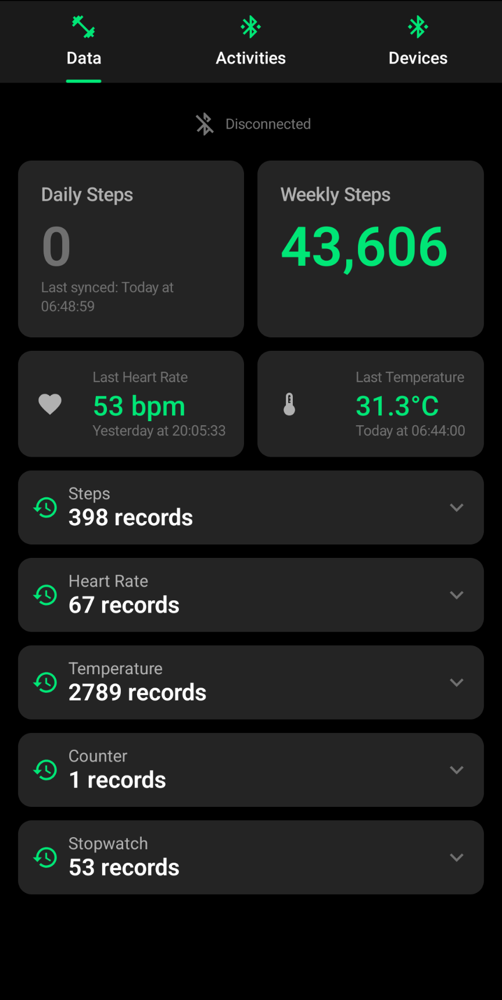
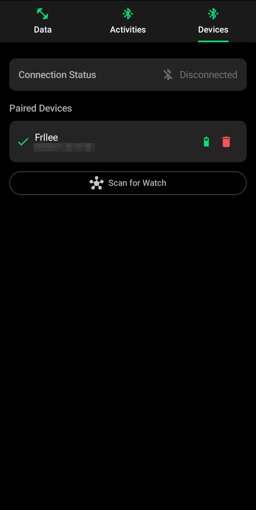
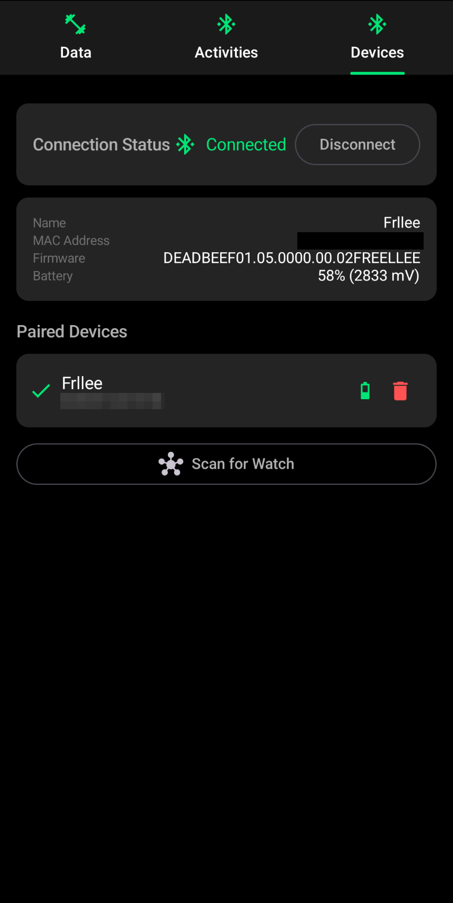
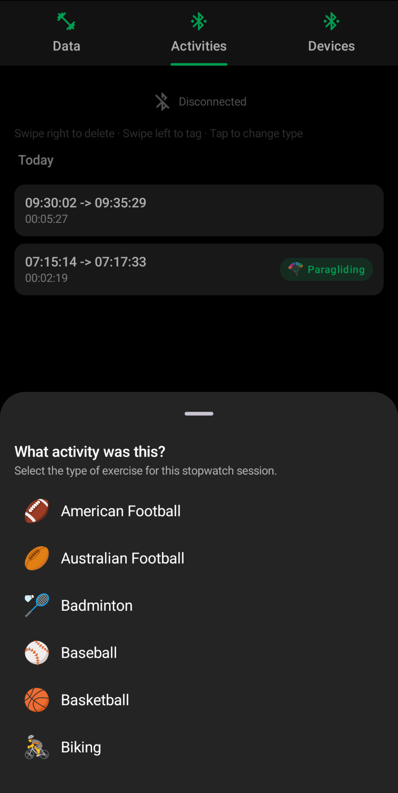

# Freellee

An **unofficial** Android app for [Ollee Watch](https://ollee.com) boards. No internet required — everything runs locally on your phone.

## Features

- **Bluetooth LE pairing** with Ollee watches (board-level firmware)
- **Syncs Steps, Heart Rate, and Skin Temperature** records to [Android Health Connect](https://developer.android.com/health-and-fitness/health-connect)
- **Stopwatch events** synced as Exercise Sessions to Health Connect
- **Compatible with official firmware** — works out of the box
- Additional tooling in repository:
  - **YAML config export/import** — read and write full watch configurations
  - **Firmware flashing** — flash custom images


## Screenshots

| Dashboard | Devices (Disconnected) | Devices (Connected) | Activities |
|---|---|---|---|
|  |  |  |  |

## Requirements

- Android 14 (API 34) or higher
- Bluetooth LE capable device

## Skin Temperature

Unlike the official app, Freellee logs temperature readings as **SkinTemperature** records (not BodyTemperature) in Health Connect. Skin temperature can help track general health and signal illness early via deviation from your personal baseline.

The day is divided into four periods — **night, morning, afternoon, evening** — each with an **independent temperature baseline** calculated from the last two weeks. At the end of each period, temperature readings are synced to Health Connect, anchored in that period's baseline.

> **Tip:** It is recommended to patch the watch firmware to perform SkinTemperature readings more often than once an hour for best results.

## Stopwatch Events

Stopwatch events from the watch appear on the **Activities** tab. Before syncing events to Health Connect as Exercise Sessions, you can select an **exercise type** (running, HIIT, football, etc.) for each session. This lets Health Connect accurately categorize and display your workouts.

## Build & Install

```bash
# Debug build
./gradlew assembleDebug

# Install on connected device
./gradlew installDebug
```

Or manually:

```bash
adb install app/build/outputs/apk/debug/app-debug.apk
```

## License

This project is licensed under the [GNU General Public License v3.0 or later](LICENSE).
